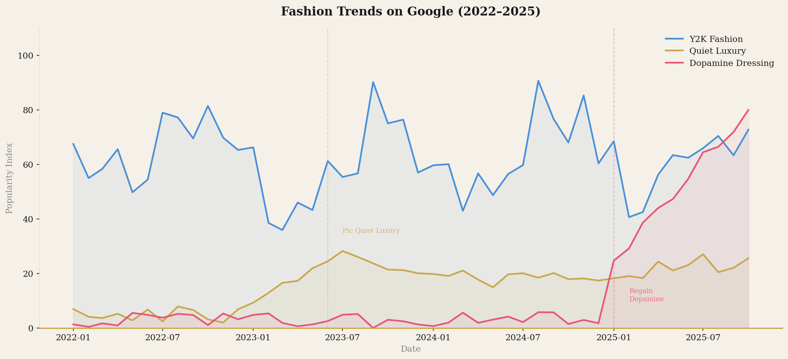
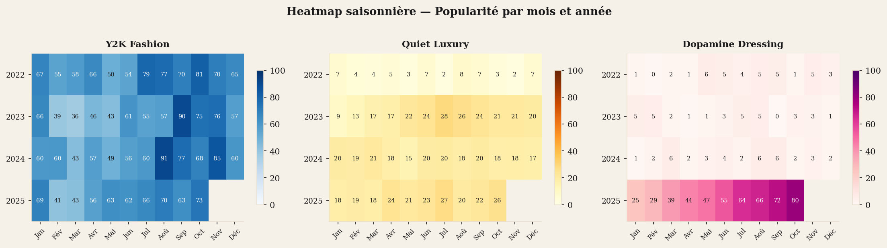
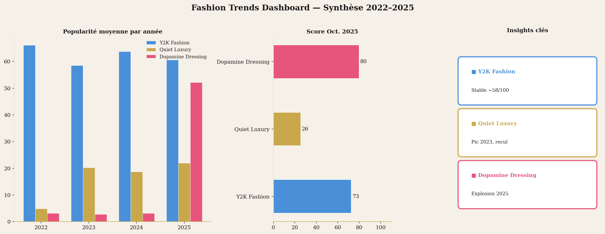
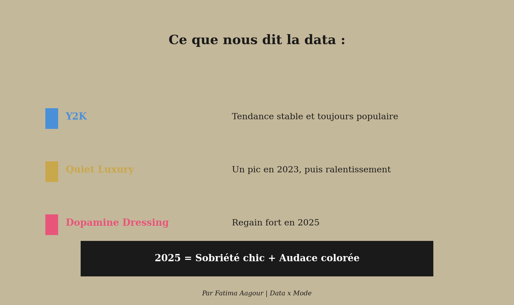

#  Fashion Trends Analysis — Google Trends 2022–2025

> Analyse de l'évolution de trois tendances mode majeures via l'API Google Trends — time series, heatmap saisonnière et insights actionnables pour Maisons de mode et de luxe.

---

## 📊 Aperçu

| Métrique | Valeur |
|---|---|
| Tendances analysées | 3 (Y2K, Quiet Luxury, Dopamine Dressing) |
| Période | Janvier 2022 – Octobre 2025 |
| Visualisations | 4 |
| Source | Google Trends (Pytrends) |

---

## 🎯 Objectifs

- Tracker l'évolution de 3 tendances mode sur 3 ans via Google Trends
- Identifier les cycles de popularité et les points de bascule
- Produire des insights actionnables pour des équipes style, marketing ou achat
- Anticiper les dynamiques de tendances à venir

---

## 🔍 Tendances analysées

| Tendance | Profil | Statut 2025 |
|---|---|---|
| **Y2K Fashion** | Stable, populaire en continu | ✅ Toujours actif |
| **Quiet Luxury** | Pic mid-2023, ralentissement | 📉 En recul |
| **Dopamine Dressing** | Quasi absent puis explosion | 🚀 Regain fort |

---

## 🛠️ Stack technique


---

## 📁 Structure du projet

```
fashion-trends-analysis/
├── fashion_trends_analysis.py   # Script principal
├── data/
│   └── fashion_trends.csv       # Données Google Trends (46 mois)
├── images/
│   ├── 01_time_series.png
│   ├── 02_heatmap_saisonniere.png
│   ├── 03_dashboard_synthese.png
│   └── 04_conclusion.png
└── README.md
```

---

## 📈 Visualisations

### 1. Time Series — Évolution des tendances


### 2. Heatmap saisonnière


### 3. Dashboard de synthèse


### 4. Conclusion & Insights


---

## 💡 Insights clés

- **Y2K Fashion** : tendance stable et toujours populaire — score moyen ~58/100 sur toute la période
- **Quiet Luxury** : pic en mid-2023 (~28/100), puis ralentissement progressif — cycle court typique du luxe aspirationnel
- **Dopamine Dressing** : quasi absent jusqu'en fin 2024, puis explosion en 2025 — signal fort pour les collections à venir
- **2025 = Sobriété chic + Audace colorée** : deux esthétiques coexistent, opportunité pour les Maisons de jouer sur les deux registres

---

## 🚀 Lancer le projet

```bash
git clone https://github.com/timaaagour/fashion-trends-analysis.git
cd fashion-trends-analysis

pip install pandas numpy matplotlib pytrends

python fashion_trends_analysis.py
```

---

## 👩‍💻 Auteure

**Fatima Aagour** — Data Analyst · Paris  
[Portfolio](https://timaaagour.github.io) · [LinkedIn](https://www.linkedin.com/in/fatima-zahra-aagour/) · aagour.fati@gmail.com
